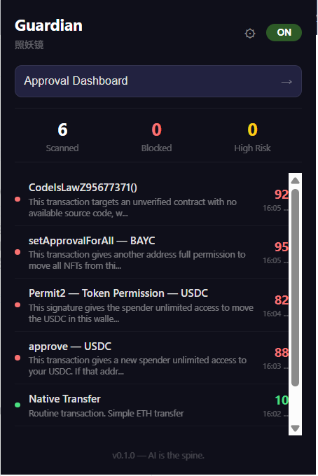

# Guardian / 照妖镜

**Stop blind signing. AI reads your transactions so you don't have to.**

Guardian is a Chrome extension that intercepts every EVM wallet signature request and provides independent risk analysis — before your transaction reaches the wallet.

<p align="center">
  
</p>

## What it does

When a dApp asks you to sign something, Guardian:

1. **Intercepts** the request (`eth_sendTransaction`, `eth_signTypedData`)
2. **Decodes** the raw calldata independently — ignores what the dApp UI shows
3. **Scores** the risk (0-100) using heuristic rules + AI analysis
4. **Shows** a clear card: what this transaction actually does, what tokens flow where, and why it might be dangerous

A dApp says "transfer" but the calldata is `approve(unlimited)`? Guardian catches it.

## Architecture

```
dApp page
  ↓  wallet request
MAIN world interceptor (injected via chrome.scripting)
  ↓  postMessage
Content script (ISOLATED world)
  ↓  chrome.runtime
Service worker
  ├── Tier 1: ABI decode + heuristic score (<200ms, local)
  ├── Tier 2: AI analysis via Guardian API (1-3s, async)
  │     ├── GoPlus threat intel
  │     ├── Etherscan contract info
  │     └── User history context
  ↓
Risk card (Shadow DOM overlay) → user approves / rejects
  ↓  chrome.scripting.executeScript
MAIN world: resolve/reject the original wallet request
```

### Security model

The decision channel is **unforgeable by page scripts**:

- MAIN world interceptor is injected via `chrome.scripting.executeScript` (no `web_accessible_resources`)
- Each tab gets a unique private `CustomEvent` name (`guardian:resolve:<UUID>`)
- User decisions flow: content script → service worker → `chrome.scripting.executeScript` dispatches the private event
- Anti-monkey-patch: uses hidden iframe to obtain pristine `EventTarget` APIs
- Page scripts cannot predict the event name, cannot call `chrome.scripting`, and cannot intercept `chrome.runtime` messages

### Backend architecture

```
Guardian Extension
  → Guardian API (auth, quota, caching)
    → codex-proxy (internal AI gateway)
      → upstream model (GPT-5.4-mini)
```

- Extension never holds API keys — only a session JWT
- Free tier: 10 AI analyses/day, paid: unlimited
- Server-side response cache + in-flight dedup (no double-charging)
- Tier 1 local analysis always available, even without login

## Risk detection

| Pattern | Detection |
|---------|-----------|
| `approve(MAX_UINT256)` | Detected as unlimited, +45 score |
| `setApprovalForAll` | +50 score, red card |
| Permit2 batch approval | EIP-712 parser, pattern-specific risk factors |
| Honeypot / phishing address | GoPlus API cross-check |
| Unverified contract | Etherscan source check + contract age |
| Unknown function calling auth | Always triggers AI |

## Features

- **Transaction interception** — wraps `window.ethereum.request()` + EIP-6963 providers
- **ABI decoding** — known fragments + 4byte.directory fallback
- **EIP-712 parsing** — Permit, Permit2, DAI permit, order signatures
- **Heuristic scoring** — local, instant, no network
- **AI analysis** — LLM explanation with full context (contract info, threat intel, user profile)
- **Approval dashboard** — scan active approvals, filter by risk, batch revoke
- **Token flow** — shows what goes out and what comes in, with USD values
- **User accounts** — register/login, free 10/day, paid unlimited
- **Accessibility** — ARIA roles on card, gauge, badge, action bar
- **Draggable card** — reposition the overlay card, boundary clamped

## Setup

```bash
npm install
npm run dev      # hot reload
npm run build    # production build
```

Load `dist/` as unpacked extension in `chrome://extensions`.

### Guardian API (self-hosted backend)

```bash
cd server

# Configure
cp .env.example .env
# Edit .env: set JWT secret, codex-proxy URL/key, etc.

# Run
node index.mjs
# Or with pm2:
pm2 start ecosystem.config.cjs
```

The extension defaults to `https://enderzcxai.duckdns.org/guardian` — override with `VITE_GUARDIAN_API_URL` in `.env.local`.

## Project structure

```
src/
├── background/   # service worker — orchestration + MAIN world injection
├── content/      # card renderer (Shadow DOM overlay)
├── core/         # ABI decoder, tier1 analyzer, approval scanner, user profile
├── ai/           # Guardian API client, prompt builder, response cache
├── intel/        # GoPlus, Etherscan, 4byte, price service
├── ui/           # ScoreGauge, RiskBadge, TokenFlow, ActionBar
├── popup/        # extension popup — login/register + history (React)
├── dashboard/    # approval management dashboard (React)
├── utils/        # formatting, EIP-712 parser, rate limiter
└── config/       # AI config, endpoints, contract database
server/
└── index.mjs     # Guardian API backend (auth, quota, AI proxy)
test/
├── smoke-extension.mjs  # Playwright e2e smoke
└── smoke-ai.mjs         # AI pipeline smoke test
```

## Tech stack

- **Extension**: MV3 + Vite + CRXJS + React + TypeScript + ethers.js
- **Backend**: Node.js (zero dependencies, stdlib only)
- **AI**: GPT-5.4-mini via OpenAI-compatible proxy
- **Intel**: GoPlus Security API + Etherscan + CoinGecko + 4byte.directory

## Stats

~5000 lines extension + ~500 lines backend, 35+ source files, 8 commits on main.

## Roadmap

- [x] Stage 0-6: Core extension (intercept, decode, score, AI, UI, e2e)
- [x] Security hardening (decision channel, cache, scoring)
- [x] Auth system + Guardian API backend
- [x] VPS deployment
- [ ] Landing page
- [ ] Chrome Web Store publish
- [ ] Infini payment integration
- [ ] Multi-chain support
- [ ] Full AI Native wallet (Phase 2)

## License

MIT

## Author

[@0xenderzcx](https://x.com/0xenderzcx)
